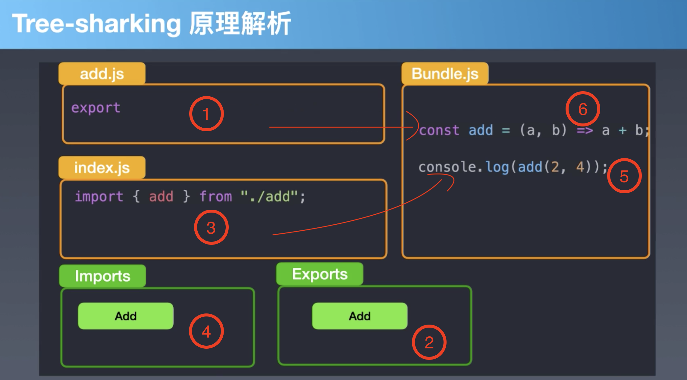

index.js
```
import { add } from "./add.js";
import { b } from "./b.js"
console.log(add(2, 4));
```

add.js
```
export const add = (a,b) => a + b
```

b.js
```
export const b = ()=> 'Hello'
```

ESmodule打包方式，将依赖代码直接打包到一起
b.js引用但没使用，打包后并不包含b.js文件
```
const add = (a,b) => a + b
console.log(add(2, 4));
```
## Rollup打包过程

- 分析来源记录export，import信息，在引用出现时填在对应的作用域内

## Tree-sharking原理
- 不是将没用代码摇掉，而是打包时将有用代码留下！
